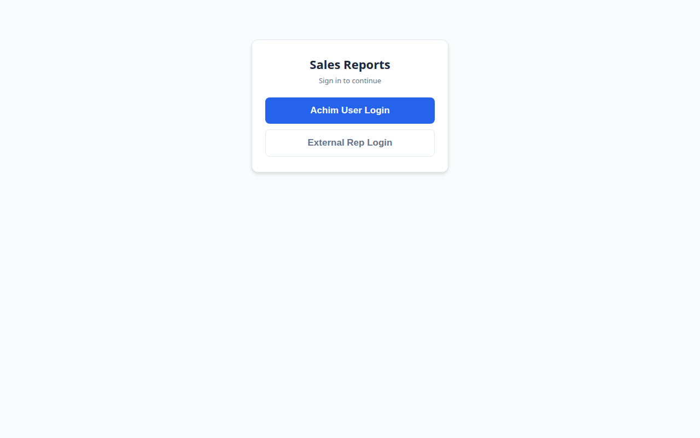
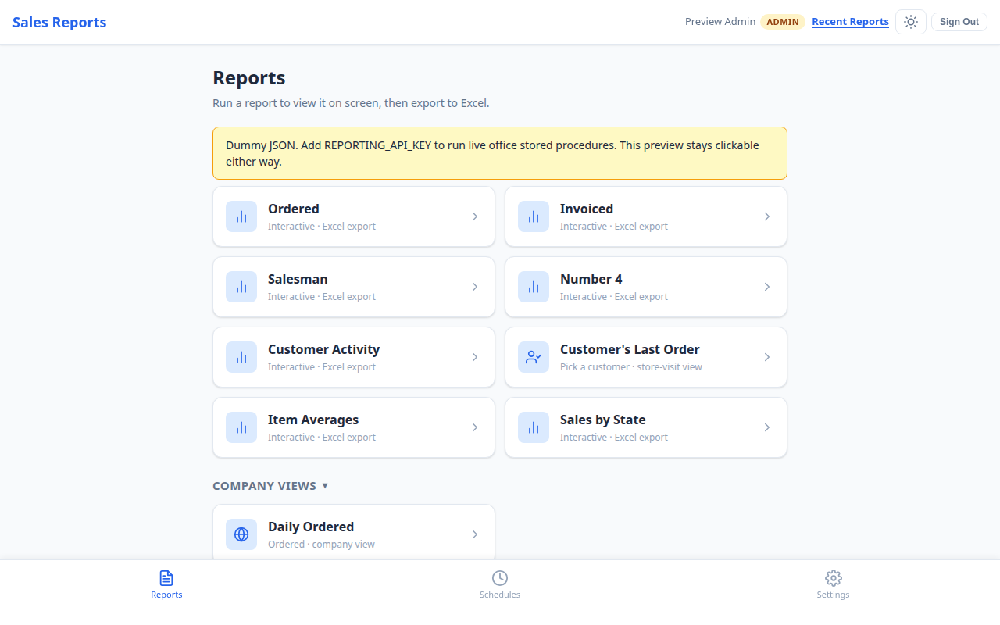
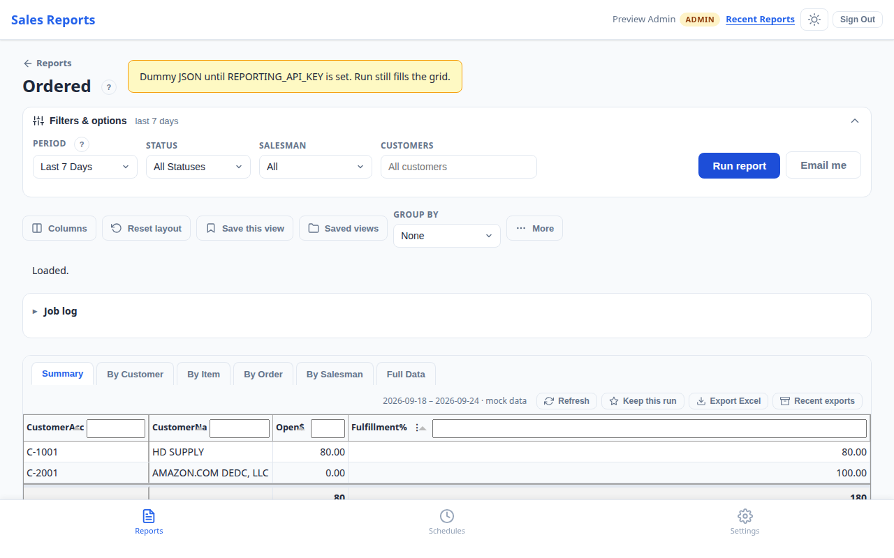
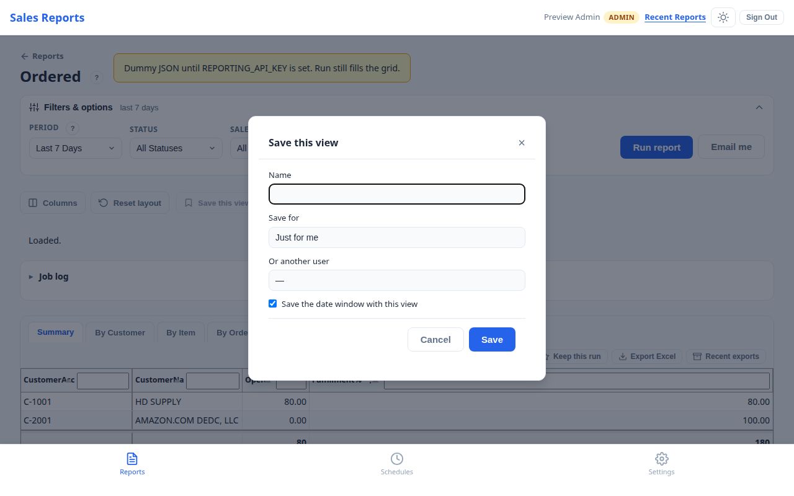
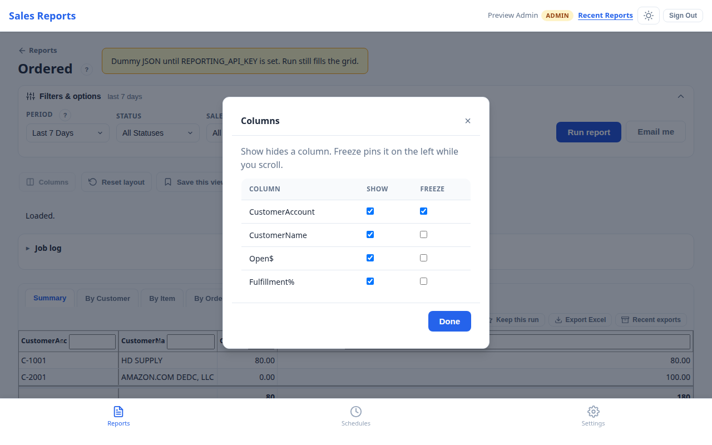
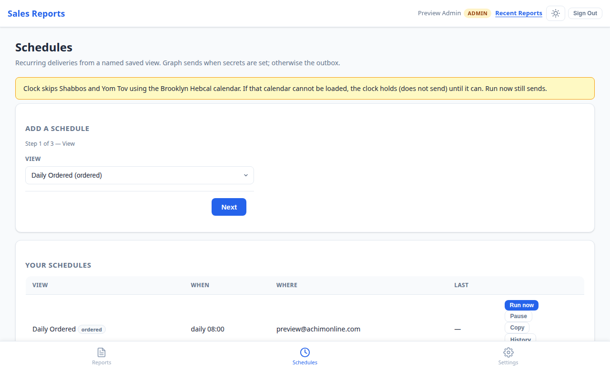
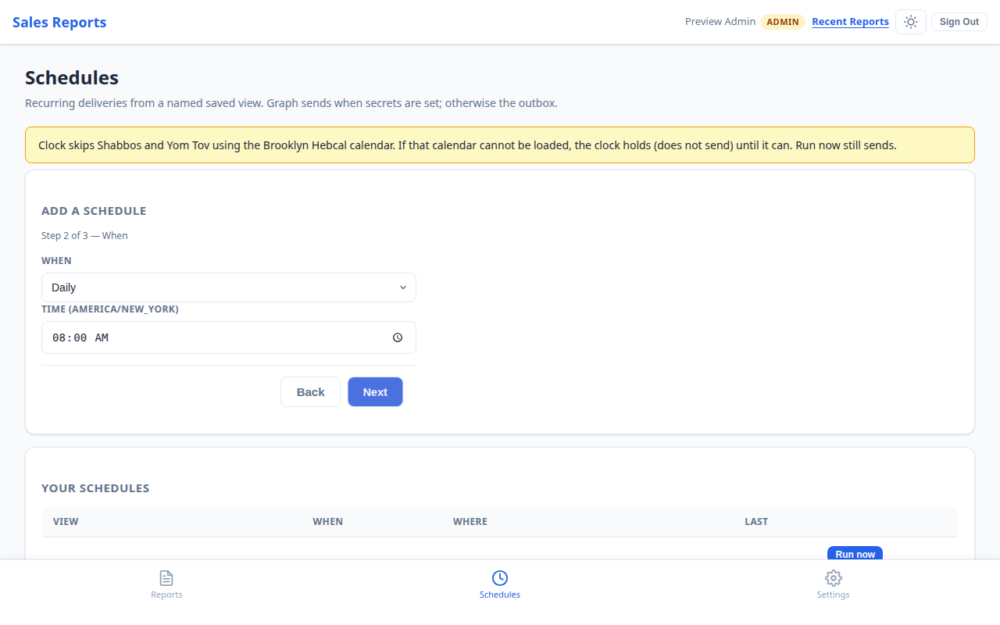
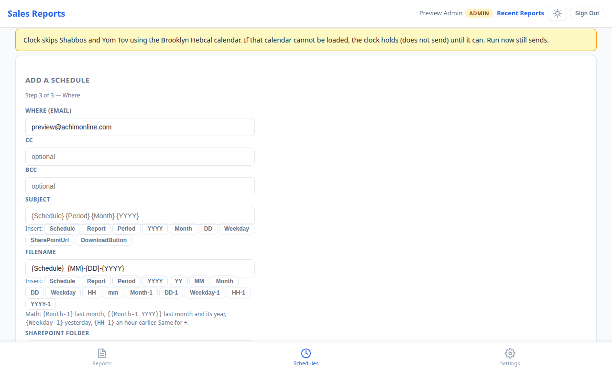
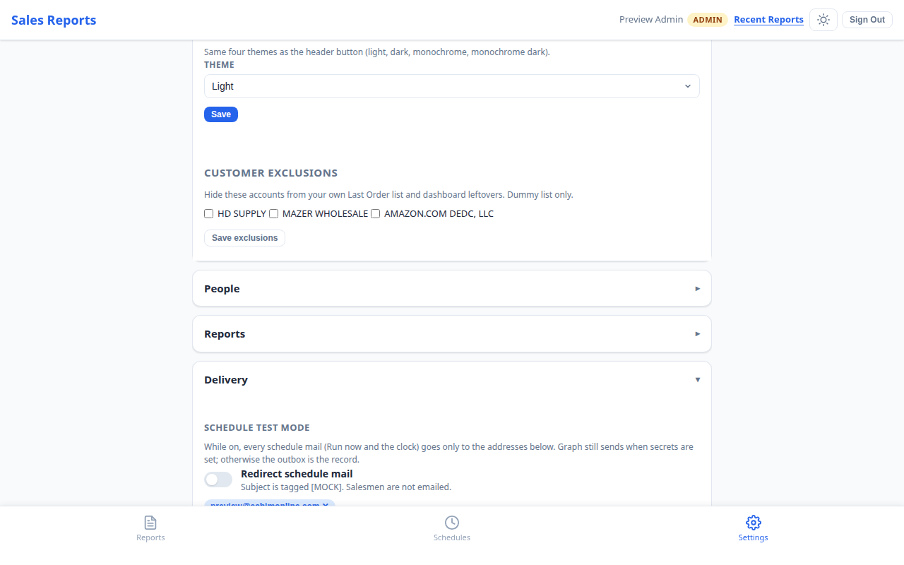

# Sales Reports FastAPI Rebuild User Manual

This guide is for the FastAPI rebuild in `app/`. It is a separate application
from the Beta v3 site. The rebuild is a preview until it is approved for its
own Azure Web App and cutover.

The screenshots show the local FastAPI preview with Dummy JSON data. A live
office report requires the Reporting API key. Live Graph email and
OneDrive/SharePoint delivery require the matching Graph settings.

## What is different from the Beta v3 site?

The FastAPI rebuild keeps the v3 look and the same main workflows, but some
controls are different:

- The rebuild uses its own FastAPI session and People data.
- The report page shows a **Group by** control in the layout toolbar.
- **Columns** opens a dialog with **Done**, instead of the v3 dropdown panel.
- **Save this view** uses **Just for me**, **Company**, or **Company Default**.
- A report result has **Export Excel** and **Recent exports** buttons. **Email
  me** is on the filter form and opens an email dialog.
- The schedule wizard is on the Schedules page. It is an inline three-step
  form, not the v3 schedule modal.
- The current FastAPI schedule form does not show v3's empty-data email
  checkboxes. Do not document or expect those checkboxes in this version.

## Quick rules

1. Save a named view before adding a schedule.
2. A schedule points to that saved view. It does not copy the layout into the
   schedule.
3. Default is the company starting view. Privileged users can save Company or
   Company Default views.
4. Save changes to a view before expecting a schedule or export to use them.
5. The preview's Dummy JSON banner means report data is local sample data.
6. Preview mail is written to the outbox unless Graph is configured.
7. Do not point `REPORTING_API_BASE_URL` at the website. It must point to the
   office Reporting API doorway.

## 1. Sign in

1. Open the FastAPI rebuild URL.
2. Select **Achim User Login**.
3. In preview, this signs in the seeded Preview Admin account.
4. On a configured site, the same button starts Microsoft Entra sign-in.
5. For an outside representative, select **External Rep Login**.
6. Enter the email from the active External People row.
7. In preview, select **Continue (no mail)**. With Graph configured, the site
   sends a one-time link that expires after 15 minutes.

There is no self-register option. An administrator must add a People row first.



## 2. Site navigation

After sign-in, the header shows:

- **Sales Reports**, which returns to Reports.
- Your name and role.
- **Recent Reports**, which opens recent and kept runs.
- The theme button.
- **Sign Out**.

The bottom navigation shows:

- **Reports**
- **Schedules**
- **Settings**

The home site does not show Dashboard in this rebuild.

## 3. Reports home

The Reports page contains cards for the reports available to your role:

- Ordered Report
- Invoiced Report
- Salesman Report
- Number 4 Report
- Customer Activity Report
- Customer's Last Order
- Item Averages for privileged users
- Sales by State

Customer Aging remains a backlog card until it is built.

The page can also show:

- **Company views**, if your role can see them.
- **My presets**, which are your saved views.
- A **Coming soon** card for a report that is not available yet.

When `REPORTING_API_KEY` is not set, the page displays a **Dummy JSON** banner.
The preview is still usable, but its rows are sample rows from the catalog.



## 4. Run a report

### Open the report

1. Select a report card.
2. Read the data-source banner before interpreting the rows.
3. Open **Filters & options**.


### Choose filters

The report displays only the fields that apply to it.

**Period** includes:

- All Time
- Month to Date
- Last Month
- Year to Date
- This Week
- Last 7 Days
- Yesterday
- Custom Range

Custom Range shows From and To date fields. Both dates are included.

Other filters can include:

- **Status** on Ordered Report.
- **Year** on Salesman Report and Sales by State.
- **Number 4 View** with Both, By Customer, or By Item.
- **Salesman**.
- **Customers**.

Leave Salesman at All and Customers empty when the report should include
everything in your access scope.

### Run

1. Select the filters.
2. Select **Run report**.
3. Wait for the status line.
4. Review the tabs and rows.

With Dummy JSON, the result is built from the local catalog fixture. With a
Reporting API key, the same page requests the office report payload.



### Result controls

The result toolbar has:

- **Refresh**: run the current filters again.
- **Keep this run**: keep the result for the configured retention period.
- **Export Excel**: download an Excel workbook.
- **Recent exports**: open earlier background exports.

The filter form has **Email me**. It runs the report and opens the email
dialog. In preview, the button says **Queue outbox mail** because Graph is not
configured.

The email dialog contains:

- **To**
- **Subject**
- **SharePoint folder**

Select **Queue outbox mail** in preview, or **Send** when Graph is configured.

If the report has no rows, widen the period or remove a filter. The FastAPI
preview does not add a separate empty-data schedule checkbox.

## 5. Save a view

A view saves the report filters and grid layout. The layout can include visible
columns, column order, widths, sort order, header filters, frozen columns,
grouping, and the visible tab order.

### Save a personal view

1. Open a report.
2. Choose filters.
3. Run the report.
4. Change the layout.
5. Select **Save this view**.
6. Enter a name.
7. Choose **Just for me**.
8. Select **Save**.



### Save a shared view

Admins and developers can choose:

- **Company**: a named view shared with users who have company-view access.
- **Company Default**: the company starting view.
- **Or another user**: save a view for a selected People row.

The FastAPI rebuild also shows **Save the date window with this view** for
privileged users. Use it when the date period belongs to the view. Leave it
off when a schedule should supply its own period.

### Open or edit a view

1. Select **Saved views**.
2. Choose a view.
3. Select its name to load it.
4. Change filters or layout.
5. Select **Save this view** again.

Saving with the same view name updates that view. A personal schedule uses the
updated view the next time it runs.

## 6. Change the report layout

### Columns

1. Run the report.
2. Select **Columns**.
3. Check the columns to show.
4. Clear a checkbox to hide a column.
5. Use the freeze control when a column should stay visible while scrolling.
6. Select **Done**.



### Grouping

Use **Group by** in the toolbar:

1. Open the Group by selector.
2. Choose a field.
3. Review the group headings and totals.
4. Choose None to remove grouping.

The report grid can also sort, filter, reorder, resize, and freeze columns.
Save the view after changing the layout.

### Reset

Select **Reset layout** to return the current view to its report defaults.
Reset does not rename or delete the saved view.

## 7. Schedule a saved view

Select **Schedules** from the bottom navigation. The page contains the
schedule wizard and your existing schedules.

If the wizard says **Save a named view on a report first**, return to Reports,
save a view, and come back. Default is not the normal choice for a personal
schedule.

### Step 1: View

1. Select a named view.
2. Confirm the report and view name.
3. Select **Next**.

The schedule points to this view. Later layout changes to the saved view are
used by the schedule.



### Step 2: When

Choose:

- **Daily**
- **Weekly**, then one or more weekdays
- **Monthly**, then a day of the month

Enter the time in `America/New_York`.



Select **Next**.

### Step 3: Where

Enter the delivery settings:

1. **Where (email)**: recipient addresses separated as the form expects.
2. **CC** and **BCC**: available to privileged users.
3. **Subject**: optional custom subject.
4. **Filename**: attachment name template.
5. **SharePoint folder**: available when the account has access.
6. **OneDrive folder**: available when the account has access.
7. Select **Save schedule**.

The FastAPI rebuild does not currently show v3's **Email me when there is no
data** or **Email test addresses when there is no data** checkboxes. Use
Settings test mode to redirect schedule mail during preview testing.



### Subject chips

The subject field supports chips such as:

- `{Schedule}`
- `{Report}`
- `{Period}`
- `{YYYY}`
- `{Month}`
- `{DD}`
- `{Weekday}`
- `{SharePointUrl}`
- `{DownloadButton}`

Leave the subject empty to use the normal schedule subject.

### Filename chips

The filename field supports:

- `{Schedule}`
- `{Report}`
- `{Period}`
- `{YYYY}` and `{YY}`
- `{MM}`
- `{Month}`
- `{DD}`
- `{Weekday}`
- `{HH}` and `{mm}`

It also supports date offsets such as `{Month-1}`, `{DD-1}`,
`{Weekday-1}`, `{HH-1}`, and `{YYYY-1}`. The same offset style can be used
with plus values. For example, `{{Month-1 YYYY}}` means the previous month
and its year.

The default filename is:

```text
{Schedule}_{MM}-{DD}-{YYYY}
```

### Manage schedules

Each saved schedule shows the view, time, recipients, and last result.

- **Run now** delivers immediately.
- **Pause** stops clock sends.
- **Resume** turns the clock back on.
- **Copy** creates a copy.
- **History** shows runs for that schedule.
- **Delete** removes it.

The schedule page also shows a recent run log. Privileged users can clear stuck
runs.

## 8. Settings

Select **Settings** from the bottom navigation.

### You

**Profile** shows your name, email, and role.

**Appearance** supports Light, Dark, Monochrome, and Monochrome Dark. Select
**Save** after changing the theme.

**Customer exclusions** removes selected accounts from the FastAPI Last Order
list and related preview data.

### People

Admins and developers can open **Users & access** to:

- Add a login.
- Choose Admin, Developer, Manager, or Salesman.
- Set a display name and SalesGroup.
- Mark a user as External.
- Enable or disable access.
- Grant Company views access.
- Grant SharePoint access.
- Set per-salesman access.
- Set per-report Inherit, Allow, or Deny.

There is no self-register option.

### Reports

Administrators can turn report visibility on or off. Feature flags are
site-wide switches. An explicit report Allow can override global visibility for
one user.

### Delivery

**Redirect schedule mail** sends preview schedule mail only to the test
addresses listed below it. In the FastAPI preview, the subject is marked
`[MOCK]`. Graph sends when Graph secrets exist; otherwise the outbox records
the message.

To test:

1. Expand Delivery.
2. Add one or more test email addresses.
3. Turn on Redirect schedule mail.
4. Use **Run now** on a schedule.
5. Check Notification diagnostic or the outbox in preview.
6. Turn test mode off after testing.



### History

Admins can open Report run log and Scheduled run history.

### Developer

Developer tools include:

- Database explorer.
- Notification diagnostic.
- Salesman and Number 4 diagnostics.
- Role picker / View as.
- Master schedules.

These tools are for maintainers. The old OData source picker is retired from
the FastAPI rebuild.

## 9. Calendar and delivery behavior

- Daily schedules run each day at the selected New York time.
- Weekly schedules run on the selected weekdays.
- Monthly schedules run on the selected day.
- Run now sends immediately and does not consume the normal clock slot.
- The clock skips Shabbos and Yom Tov using the Brooklyn Hebcal calendar.
- If the calendar cannot be loaded, the clock holds instead of sending.
- Graph mail is used when Graph settings are complete.
- Without Graph, preview mail is stored in the outbox.

## 10. FastAPI preview limits

The FastAPI rebuild is not the current production site. Until cutover:

- Dummy JSON is sample data.
- The Reporting API key is not committed to the repository.
- Graph email is not active without Graph settings.
- SharePoint and OneDrive are not live without the required access.
- The preview login is for local preview only.
- Do not point the preview at `reports.achimonline.com` as its Reporting API.

## Common problems

### The login page has no Microsoft button

The preview uses Achim User Login. A live Entra button appears only when the
Graph and Entra settings are configured.

### The report shows Dummy JSON

That is expected without `REPORTING_API_KEY`. The screen is working, but the
rows are local sample data.

### A schedule cannot be added

Save a named view first. The schedule form only accepts a view that the user
can use.

### Mail did not arrive

In preview, mail is stored in the outbox unless Graph is configured. Check
Settings, then Developer, then Notification diagnostic.

### A saved layout did not reach an export

Load the saved view, make the layout change, and save it again. Exports apply
the saved view layout when a view is selected.

## Short checklist

For a report:

1. Reports
2. Choose a report
3. Set Filters & options
4. Run report
5. Change Columns, Group by, sort, or filters
6. Save this view
7. Export Excel or Email me

For a schedule:

1. Save a named view
2. Open Schedules
3. Choose the view
4. Set Daily, Weekly, or Monthly
5. Set the New York time
6. Set recipients, subject, filename, and folders
7. Save schedule
8. Turn on test mode and Run now before using live delivery
