# Sales Reports User Manual

Use this guide to sign in, run reports, save views, change the report layout,
and send reports on a schedule.

The screenshots show the local preview with representative data. The labels and
steps match the user-facing site.

## Quick rules

Keep these rules in mind:

1. Save a named view before you add a personal schedule.
2. A personal schedule sends the saved view it is linked to.
3. Default is the company-wide starting layout. It cannot be deleted.
4. Company views are shared layouts. My views are your saved layouts.
5. Save view changes before scheduling. Unsaved changes are not sent.
6. Custom date ranges are for on-demand reports. They cannot be scheduled from
   Default.
7. Save or turn on a schedule to wait for its next time. Use Run now for an
   immediate delivery.

## 1. Sign in and find your way around

### Sign in

1. Open the Sales Reports site.
2. Select **Achim User Login** to sign in with your company account.
3. If you are an outside representative without a company Microsoft account,
   select **External Rep Login**.
4. Enter the email address registered for your account.
5. Select **Send sign-in link**. The one-time link expires after 15 minutes.

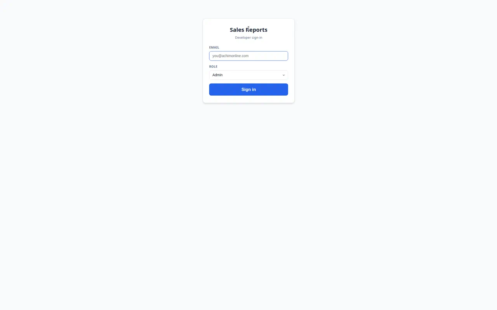

After you sign in, the site opens on **Reports**.

### Main navigation

The bottom navigation is the same throughout the site:

- **Reports** opens the report list.
- **Schedules** shows your saved report deliveries.
- **Settings** contains your profile and, for administrators, access and
  delivery controls.
- **Dashboard** may appear on sites where dashboard access is enabled.

The top bar includes:

- **Sales Reports**, which returns to the report list.
- Your name and role.
- **Recent Reports**, which opens recent and kept runs.
- The theme button.
- **Sign Out**.

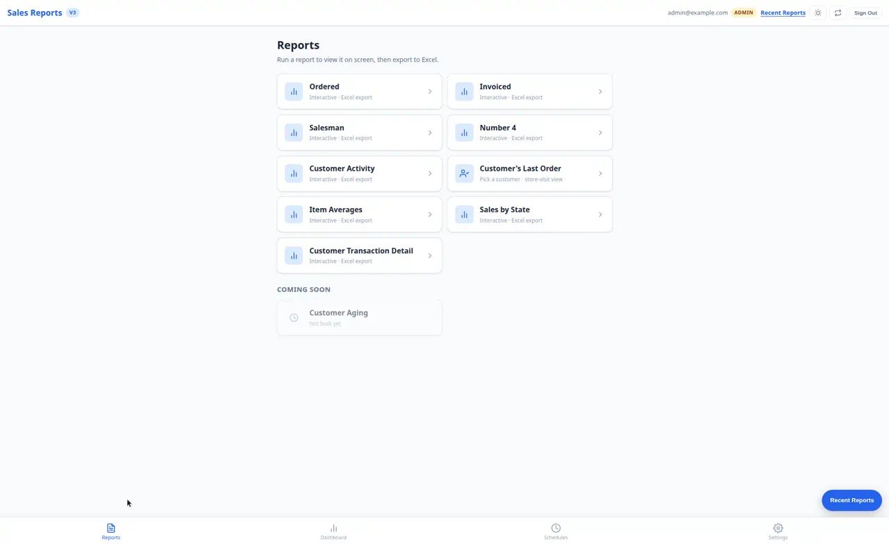

### Roles and access

Your role controls what you can see:

- **Salesman** sees reports and views allowed for that account.
- **Manager** can have access to selected salesmen and may receive permission
  to use company views.
- **Admin** can manage users, company views, report visibility, and schedule
  test mode.
- **Developer** has the admin controls plus developer tools.

An administrator can also limit a manager or salesman to specific SalesGroups.
That limit affects report rows, salesman lists, customer lists, and schedules.

## 2. Settings

Select **Settings** from the bottom navigation. Sections open and close when
you select their headings.

### You

**Profile** shows your name, email, and role.

**Appearance** lets you choose:

- Light
- Dark
- Monochrome
- Monochrome Dark

Select **Save** after changing the theme.

**Customer exclusions** removes selected customers from dashboard metrics and
overdue alerts. Search for a customer, select it, and remove it from the
selected list when it should be included again.

### People

This section is available to administrators. Select **Users & access** to:

- Add or edit a login.
- Set a role.
- Grant or remove report access.
- Set a user's SalesGroup access.
- Enable company views for a user who should be allowed to use them.

Company views access and company schedule management are different permissions.
Admins and developers can manage company views. A manager with the company
views permission can edit them. A salesman with the permission can use them
but cannot edit or delete them.

### Reports

Administrators can turn a report on or off for the site. When a report is off,
it disappears from the Reports page unless the user has an explicit allow.

Feature flags are site-wide switches. Change them only when you know what the
switch controls.

### Delivery

Delivery is available to administrators. It contains **Schedule test mode**.

When **Redirect schedule mail** is on:

- Personal and company schedule mail goes only to the listed test addresses.
- The subject is marked `[TEST]`.
- Live OneDrive and SharePoint folders are not written.
- Salesman split reports still run, but every file goes to the test list.
- At least one test email address is required.

To set it up:

1. Expand **Delivery**.
2. Select **Add test email**.
3. Enter an address and select **Add**.
4. Repeat for each tester.
5. Turn on **Redirect schedule mail**.
6. Run a schedule manually and confirm the test message before enabling the
   real schedule.

Turn test mode off after testing. The test addresses may still receive a
failure notice if a schedule fails after its automatic retry.

### History

Administrators can open:

- **Report run log** for report jobs.
- **Scheduled run history** for schedule deliveries.

## 3. Choose and run a report

### Choose a report

On the Reports page, select a report card. The available reports depend on your
role and the site's report settings.

Common reports include:

- **Ordered Report**: orders placed in the selected period.
- **Invoiced Report**: shipments and invoices in the selected period.
- **Salesman Report**: month-by-month sales comparisons for a selected year.
- **Number 4 Report**: monthly quantities and dollars by item or customer.
- **Customer Activity Report**: each customer's most recent order, organized
  by salesman.
- **Sales by State**: invoiced sales by state for a selected year.
- **Customer Transaction Detail**: original customer transactions and their
  settlements.
- **Customer's Last Order**: a customer lookup and last-order view.

The report card explains whether the report is interactive and can be exported
to Excel.

### Set the report options

Open **Filters & options**. A report shows only the fields that apply to it.

**Period** options are:

- **All Time**: no date limit.
- **Month to Date**: the first day of this month through today.
- **Last Month**: the complete previous calendar month.
- **Year to Date**: January 1 through today.
- **This Week**: this week's dates.
- **Last 7 Days**: the previous seven days.
- **Yesterday**: yesterday only.
- **Custom Range**: enter From and To dates. Both dates are included.

**Status** is available on Ordered Report. Choose All Statuses, Open,
Delivered, Invoiced, or Cancelled.

**Salesman** limits the report to one SalesGroup. Leave it at **All salesmen**
to include everyone you are allowed to see.

**Customers** searches by customer name or account number. Select one or more
customers. Leave the field empty to include all customers in your scope.

Other report-specific options include:

- **View** on Number 4: By Customer, By Item, or Both.
- **Year** on Salesman Report and Sales by State.
- **Invoice** on Customer Transaction Detail.
- **Open only** on Customer Transaction Detail.

On Ordered Report, **Open** status means the report covers all currently open
orders. The selected date period does not narrow that open-order list.

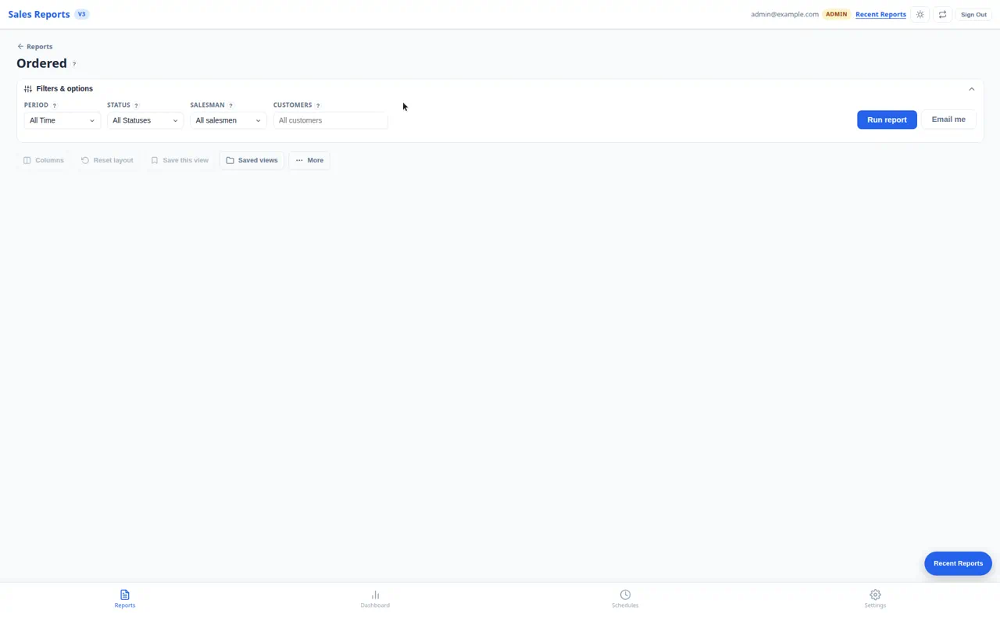

### Run the report

1. Choose the filters.
2. Select **Run report**.
3. Wait for the status line to finish.
4. Review the tabs and rows.

The report keeps the selected layout when you refresh a report that is already
on screen.

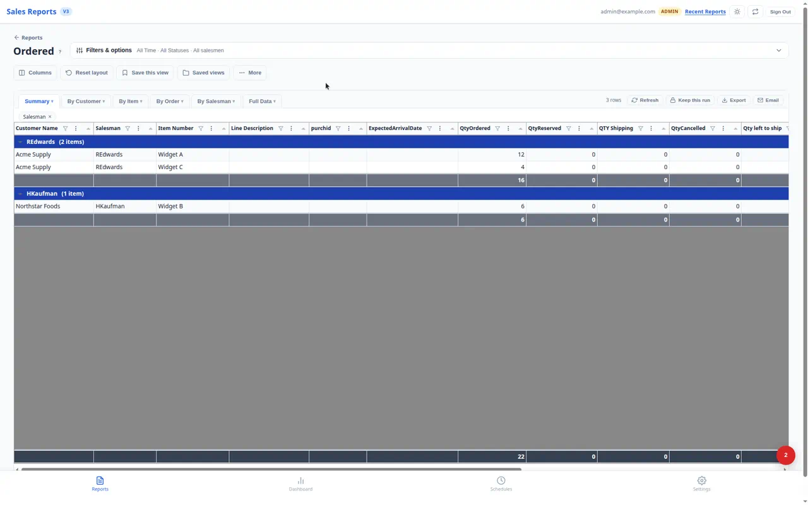

### Work with the result

The result toolbar includes:

- **Refresh**: run the same filters again and keep the current layout.
- **Keep this run**: keep the result available for up to 30 days. The account
  can keep up to five runs.
- **Export**: choose **Download Excel now** or open **Recent exports**.
- **Email**: send the current result to selected recipients and optionally
  save it to SharePoint.

**Email me** beside Run report runs the report and sends the Excel file to your
own email address. Use **Email** beside the result when you need to choose
other recipients or a SharePoint folder.

If the result has no rows, the report shows a no-data state. Widen the period,
remove a customer or salesman filter, or check whether a status filter is
excluding the rows you expected.

## 4. Save a view

A saved view remembers the report filters and the report layout. Layout includes
the visible tabs, tab order, visible columns, column order, widths, sort order,
column filters, frozen columns, and grouping.

### Save your first view

1. Open a report.
2. Choose the filters.
3. Run the report.
4. Change the tabs, columns, sorting, grouping, or filters as needed.
5. Select **Save this view**.
6. Enter a clear name, such as `Daily Open Orders`.
7. In **Save for**, choose **Me**.
8. Select **Save**.

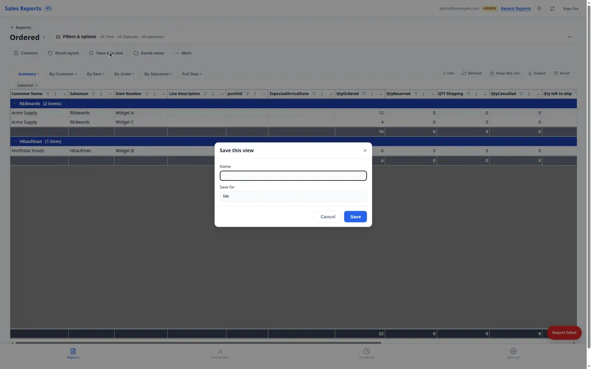

If you are an administrator or developer, **Save for** can also include:

- **Company**: make the view available as a shared company view.
- A selected user: save the view for another user.

When saving a company view, you can choose **Save the date window (period)
with this company view**. Leave it unchecked when the schedule should supply
its own period.

### Open, edit, or delete a view

1. Select **Saved views**.
2. Open the **Company views** or **My views** section if needed.
3. Select the view name to load it and run it.
4. Select **Edit** to load the view without starting a new run when a result
   is already visible.
5. Change the layout or filters.
6. Select **Save this view** to update the view.
7. Use **Delete** on a personal view or an editable company view when it is no
   longer needed.

When you save while editing a named view, the site updates that view. It does
not create a second view unless you give it a new name.

## 5. Default, company, and My views

### Default

Default is the company's starting layout for that report. It can include the
current tab order, visible columns, grouping, and sort settings.

Default is always available. It cannot be deleted.

Admins and developers can schedule Default. Other users must schedule a named
view.

### Company views

Company views are named layouts shared with users who have permission to see
them. Examples include `Daily Ordered` and `Heshy Open Orders`.

They can include filters and layout changes. A company view can store a date
window only when the save dialog's period checkbox is selected.

Company schedules supply their own send period. This lets one company view be
used for daily, month-to-date, or year-to-date schedules without changing the
shared layout.

### My views

My views belong to one user. They are the right choice when the filters,
columns, tabs, or grouping are personal.

A personal schedule sends the live version of its named view. If you edit and
save the view later, the next scheduled delivery uses those saved changes. You
do not need to recreate the schedule.

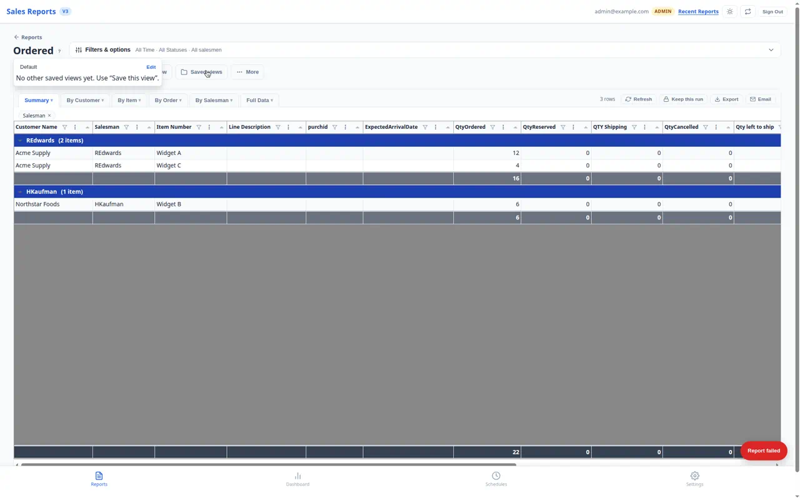

## 6. Change the report layout

Run the report before changing the result layout. Select **Reset layout** if
you want to return the current tab to its report defaults.

### Show or hide tabs and columns

1. Select **Columns**.
2. Under **Tabs**, check the tabs you want to keep.
3. Under **Columns**, check the columns you want to show.
4. Select **Show all** to restore hidden columns.
5. Close the panel.

At least one tab must remain visible.

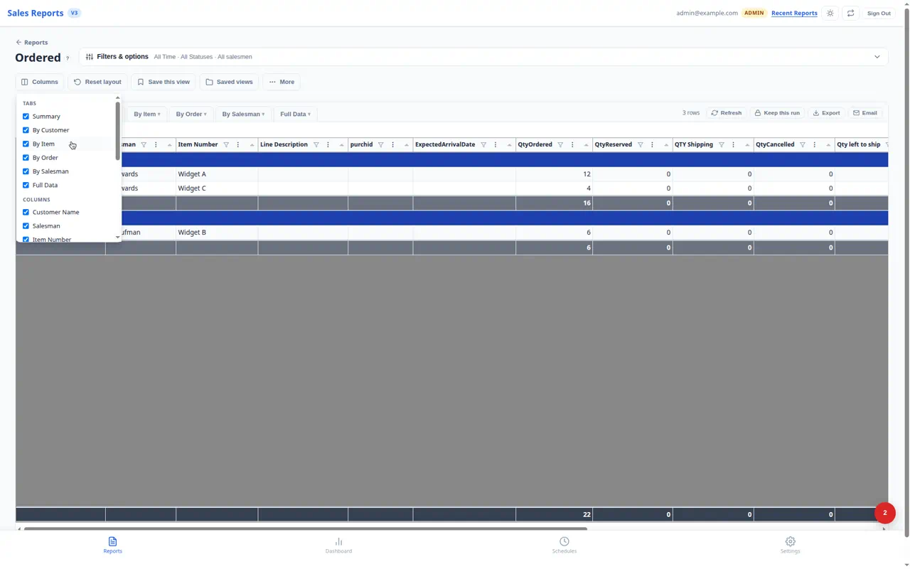

### Move or resize columns

- Drag a column header to move it.
- Drag a column edge to change its width.
- Select **Reset layout** to undo the layout changes for that tab.

### Hide, freeze, or group from a column header

Open a column header menu. The available options are:

- **Hide column**: remove the column from the current tab.
- **Freeze / unfreeze**: keep the column in place while you scroll.
- **Group by this column**: group rows by the selected field.
- **Add subgroup**: add a second grouping level.
- **Clear grouping**: remove all grouping from the tab.

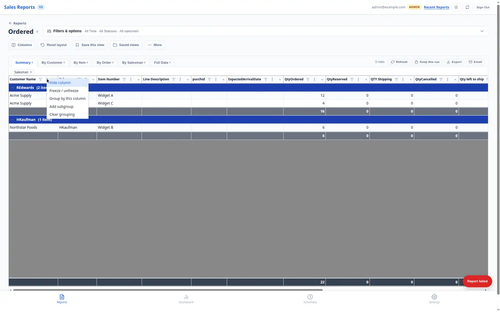

### Sort rows

Select a column header to sort it. Select it again to change the direction.
When rows are grouped, the grouping stays together while the selected column
sorts within each group.

### Filter a column

1. Select the filter icon in a column header.
2. Choose an operator.
3. Enter a value. A Between filter uses two values.
4. Select **Apply**.
5. Select **Clear** to remove that column filter.

Text fields can use contains, equals, starts with, ends with, is one of
comma-separated values, is empty, or is not empty.

Number fields can use equals, not equal to, greater than, greater than or
equal, less than, less than or equal, between, is empty, or is not empty.

Date fields can use on, before, after, between, is empty, or is not empty.

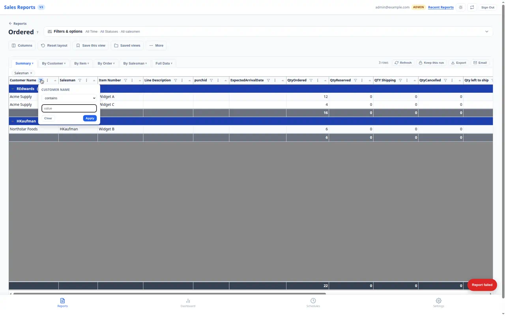

### Add, rename, or remove tabs

Open a tab's context menu:

- **Duplicate tab** copies the tab and its layout.
- **Rename tab** is available on a duplicated tab.
- **Remove tab** hides an original tab from this view.
- **Delete tab** removes a duplicated tab.

Save the view after changing tabs if the changes should be used again or sent
by email.

## 7. Set up a schedule

There are two ways to start:

- Select **Schedules**, then **Add a schedule**.
- Open a report, load a named view, select **More**, then **Schedule**.

The Add button is disabled until you have a schedulable saved view. If you do
not see a view in the wizard, return to the report, save it with a name, and
open Schedules again.

### Step 1: View

1. Select the owner or view group when that choice is available.
2. Select the saved view.
3. Confirm that the view contains the filters and layout you want to send.

The schedule sends the named view that is selected here. Save any layout
changes before you continue.

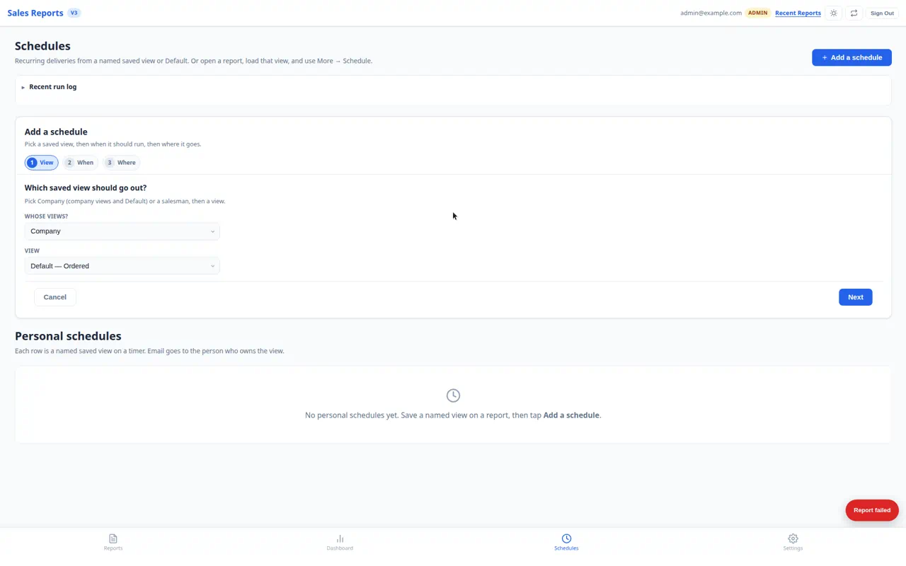

### Step 2: When

Choose:

- **Every day**: run daily at the selected time.
- **Every week**: choose one or more weekdays.
- **Every month**: choose one or more days from 1 through 28, or **Last day**.

Enter the time in **Eastern time**, which is the New York office clock.

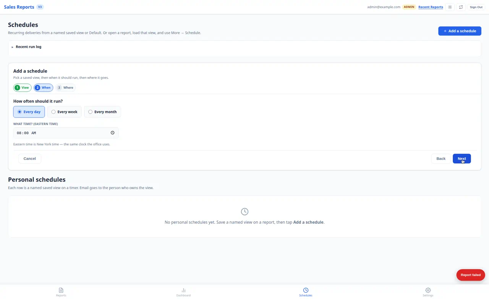

### Step 3: Where

Choose the delivery and file options:

1. Set the filename template.
2. Leave **Email to** selected to send to the view owner.
3. Add extra recipients when your role allows it.
4. Add CC or BCC addresses when your role allows it.
5. Select OneDrive or SharePoint and choose a folder when a folder copy is
   needed.
6. Select **Email me when there is no data** if an empty report should send a
   notice.
7. Privileged users can also select **Email test addresses when there is no
   data**.
8. Select **Save schedule**.

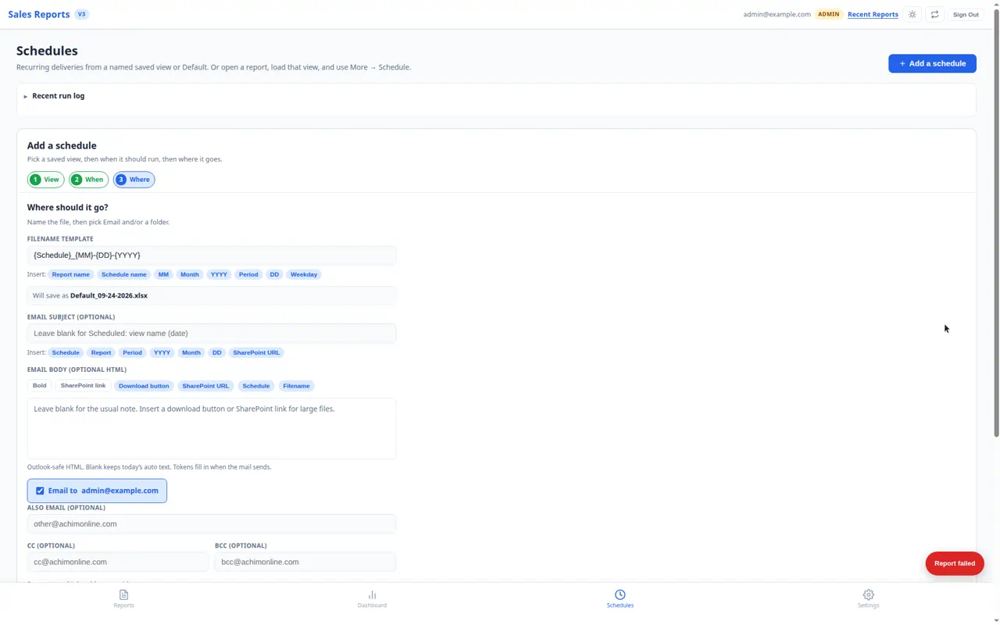

### Filename tokens

The filename can include:

| Token | Meaning |
| --- | --- |
| `{Report}` | Report name |
| `{Schedule}` | Saved view or schedule name |
| `{Period}` | Report period |
| `{MM}` | Two-digit month |
| `{Month}` | Month name |
| `{YYYY}` | Four-digit year |
| `{DD}` | Two-digit day |
| `{Weekday}` | Weekday name |

The default is:

```text
{Schedule}_{MM}-{DD}-{YYYY}
```

The preview under the field shows the filename the next delivery will use.

### Email subject and body

The personal schedule wizard can use the automatic subject and note. Leave
both fields blank to keep them.

To customize them:

1. Enter an **Email subject**.
2. Add supported subject tokens such as `{Schedule}`, `{Report}`,
   `{Period}`, `{YYYY}`, `{Month}`, `{DD}`, or `{SharePointUrl}`.
3. Add text or Outlook-safe HTML to **Email body**.
4. Use `{DownloadButton}` or `{SharePointUrl}` when large files should be
   opened from SharePoint instead of attached.
5. Save the schedule.

The site removes unsafe script and link markup before storing custom email
content.

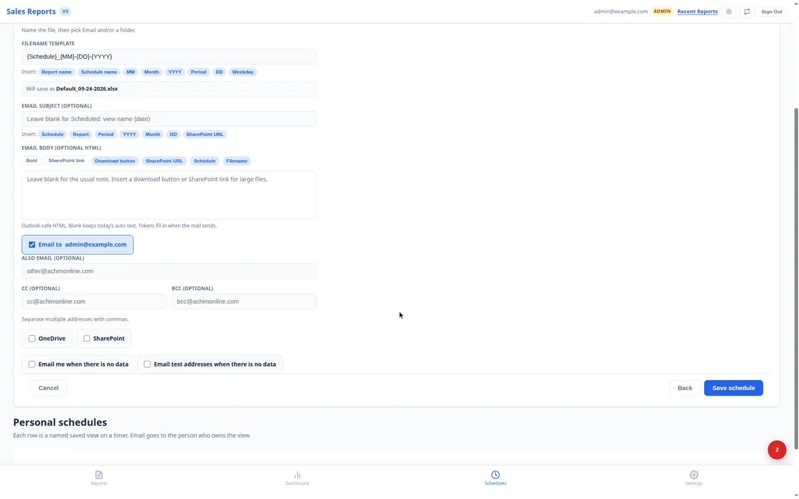

### Manage schedules

On **Schedules**, each row shows the report, view, cadence, recipients, folder,
last run, and status.

- **On / Off** changes whether the clock can send it.
- **Edit** changes the schedule.
- **Run now** sends immediately and ignores the normal time slot.
- **Copy** creates an inactive copy.
- **History** shows every run for that schedule.
- **Delete** removes the schedule.

Turning a schedule on or saving an edit waits for the next scheduled time. It
does not send immediately.

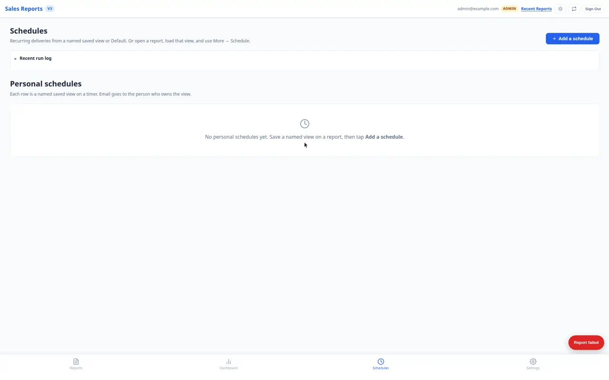

## 8. Email and empty reports

### Send one report now

Use **Email me** beside **Run report** when the file should go only to you.
The report runs with the current filters.

Use **Email** beside a completed result when you need to:

1. Enter one or more recipients.
2. Change the subject.
3. Choose a SharePoint folder.
4. Select **Send**.

### Send an empty-report notice

A report can finish successfully with no matching rows. Select **Email me when
there is no data** in the schedule setup if the owner should receive a notice
in that case.

Privileged users can also select **Email test addresses when there is no data**.
That option uses the test email list from Settings. It does not send the empty
report to the schedule's normal recipients.

If no notice is needed, leave both empty-data checkboxes clear. The schedule
still runs and its normal delivery rules apply.

### Test a schedule safely

1. Go to **Settings**.
2. Expand **Delivery**.
3. Add one or more test email addresses.
4. Turn on **Redirect schedule mail**.
5. Go to **Schedules**.
6. Select **Run now** on the schedule.
7. Confirm the `[TEST]` subject and the attachment or folder link.
8. Turn test mode off when finished.

Test mode redirects both personal and company schedules. It does not write to
live OneDrive or SharePoint folders.

## 9. Cadence and calendar behavior

All schedule times use Eastern time.

- A daily schedule runs on each calendar day at its time.
- A weekly schedule runs only on the weekdays selected.
- A monthly schedule runs on each selected day or on the last day of the month.
- A saved schedule is checked at most once for each scheduled time.
- Run now is an immediate manual run. It does not consume the regular day's
  clock slot.

Schedules skip Shabbos and Yom Tov according to the site's Brooklyn calendar
settings. Depending on the period, the site either waits for the next regular
slot or makes up the skipped run on a later weekday. Run now is manual and
still runs.

## 10. Common problems

### Add a schedule is disabled

Save a named view first. Default is only schedulable by an admin or developer.
Custom date ranges are not eligible for scheduling.

### Schedule is disabled from a report

Load a named saved view and save any layout or filter changes. Then select
**More > Schedule** again.

### The report is empty

Check the period, status, salesman, and customer filters. On Ordered Report,
check whether Open status is showing a different set of orders than the date
period you expected.

### The layout changed on screen but not in email

Load the saved view, make the layout change, and select **Save this view**.
Personal schedules use the saved view, not unsaved screen changes.

### A test email went to a normal address

Confirm that **Redirect schedule mail** is on and that the intended test
addresses are listed in Settings before selecting Run now.

### A schedule did not send at the time shown

Check the schedule is On, confirm the time is Eastern time, and open History.
If the run failed, open the run details or ask an administrator to check the
scheduled run history.

## Short checklist

For an on-demand report:

1. Reports
2. Choose a report
3. Set Filters & options
4. Run report
5. Adjust tabs, columns, sorting, grouping, or filters
6. Export or Email
7. Save this view if you will use it again

For a scheduled report:

1. Run the report and set the layout
2. Save this view with a name
3. Open Schedules
4. Add a schedule
5. Choose the view
6. Set the Eastern time and cadence
7. Set email, folders, filename, and empty-data options
8. Save schedule
9. Test with Redirect schedule mail before turning it on for real
